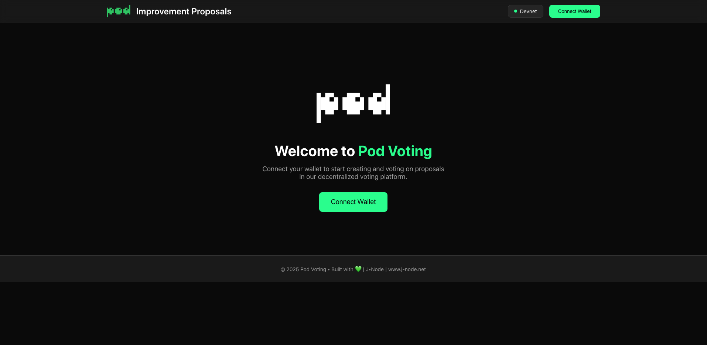

# 🗳️ Pod Voting DApp

A fully onchain governance system built on [Pod Network](https://pod.network), consisting of a smart contract for proposals and voting (backend) and a frontend interface built with Next.js + RainbowKit.

## ✨ Features

- ✅ Create proposals with custom duration
- ✅ Vote on proposals (For / Against)
- ✅ Fully onchain, built for blockless Pod Network
- ✅ Integrated with RainbowKit & wagmi for wallet connection


[https://pod-voting.j-node.net/](https://pod-voting.j-node.net/)

---

## 📁 Project Structure

```
pod-voting-dapp/
├── backend/     # Foundry contracts, deployment and test scripts
└── frontend/    # Next.js DApp UI with wallet connection
```

---

## ⚙️ Backend (Foundry)

### 📦 Install Dependencies

```bash
cd backend
forge install
```

### ⚗️ Run Tests

```bash
forge test
```

### 🛠 Deploy Contract

Set environment variables in `.env`:

```
PRIVATE_KEY=your_private_key
RPC_URL=https://rpc.v2.pod.network
```

Then run:

```bash
forge script script/deploy.s.sol \
  --rpc-url $RPC_URL \
  --private-key $PRIVATE_KEY \
  --broadcast
```

### 🤝 Interact with Contract

Use the interaction script to call contract functions:

```bash
forge script script/interact.s.sol \
  --rpc-url $RPC_URL \
  --private-key $PRIVATE_KEY \
  --broadcast
```

---

## 🖥 Frontend (Next.js + RainbowKit)

### 📦 Install

```bash
cd frontend
npm install
```

### 🧪 Run Dev Server

```bash
npm run dev
```

### ⚙️ Configure Contract

Edit `frontend/constants/contract.ts` to point to the deployed contract address:

```ts
export const POD_GOVERNANCE_ADDRESS = '0xYourDeployedContractAddress';
```

---

## 🧱 Contract

The main contract is `PodGovernance.sol` which includes:

- `createProposal(string description, uint duration)` – to create a new proposal
- `vote(uint proposalId, uint8 voteType)` – to vote For (1) or Against (0)

All proposals and votes are stored onchain, and compatible with Pod's blockless structure.

---

## 🧠 Notes

- Voting is permissionless
- Proposals auto-close after the defined duration
- Built for educational and demo purposes – not audited

---

## 📜 License

MIT License

---

## ✨ Built by [J-Node](https://j-node.net)
